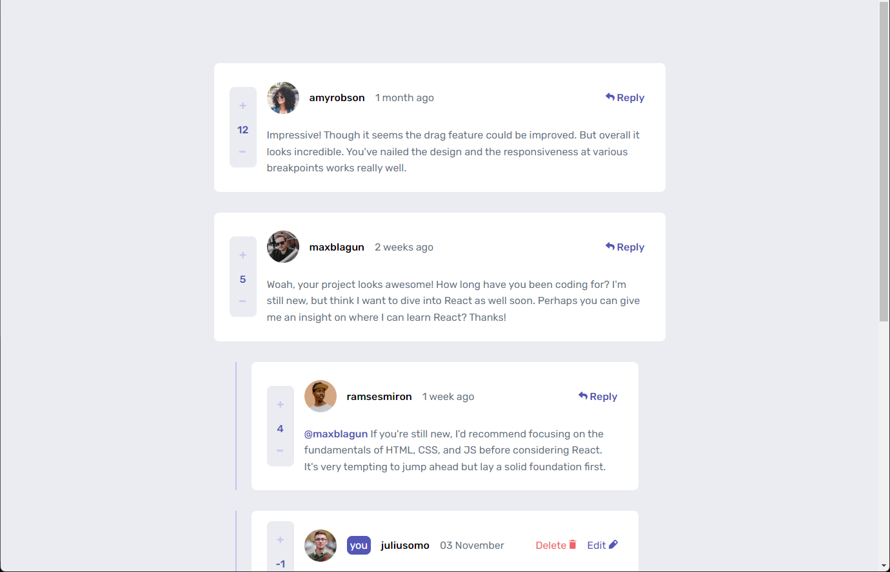

# FrontEnd Mentor Challange

This is a solution to the [Interactive comments section challenge on Frontend Mentor](https://www.frontendmentor.io/challenges/interactive-comments-section-iG1RugEG9).

### Screenshot

### Built with

- Semantic HTML5 markup
- CSS3
- Flexbox
- JS

### Links

- [Live Site URL](https://int-com-sect.netlify.app/)

### Things implemented

- Responsive design
- Modal
- Animations

### Things user able to do

- Reply to comments
- Create comment
- Delete or edit own comment/reply
- Rate comments or replies

### Things learned

- DOM traversal
- Array filter method
